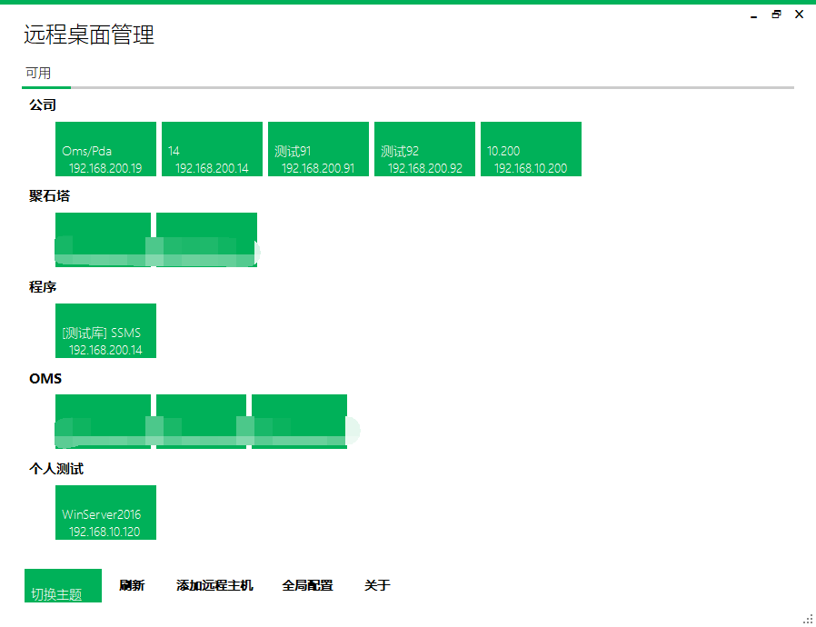
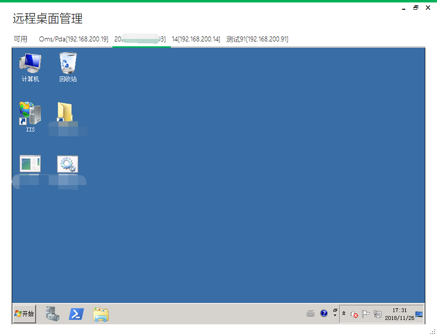
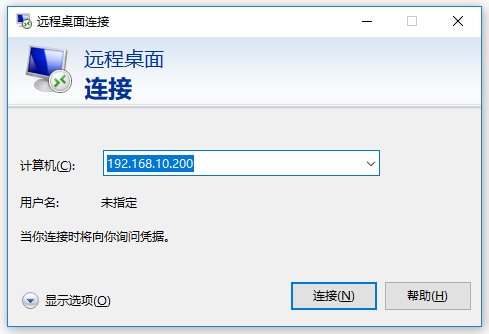
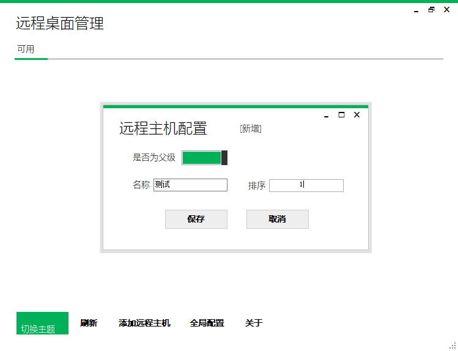
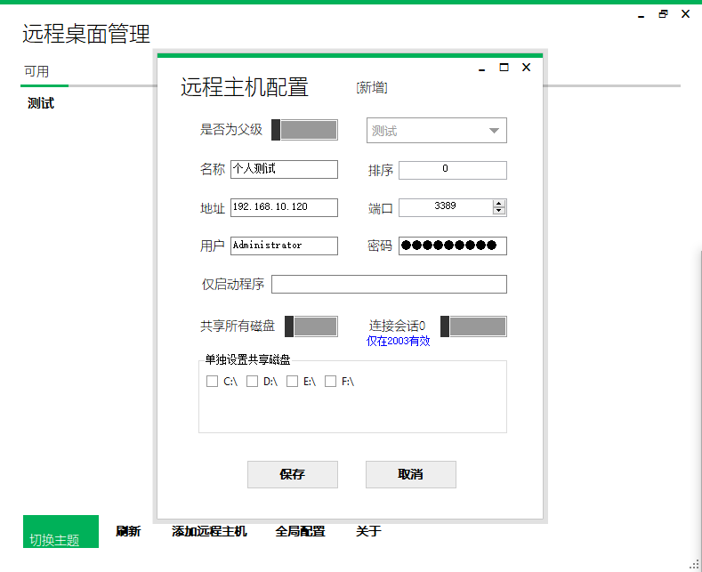
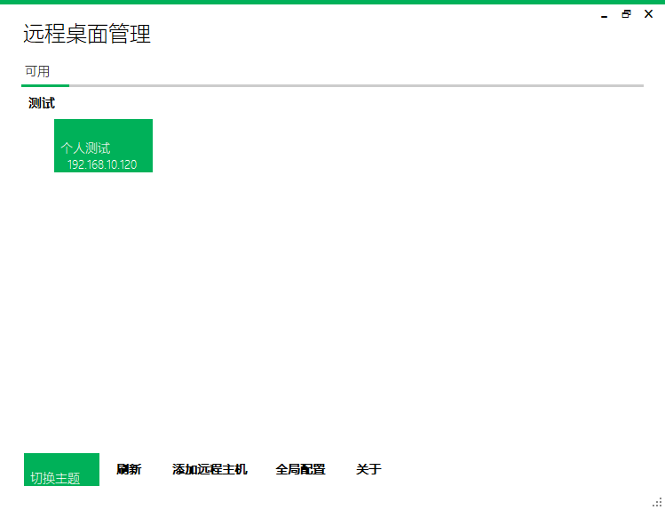
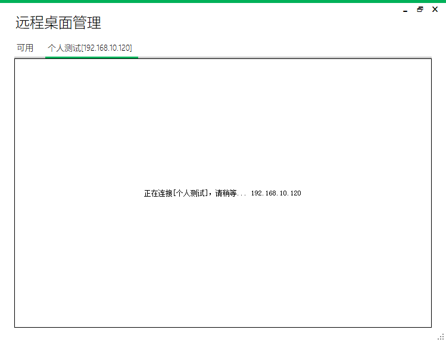
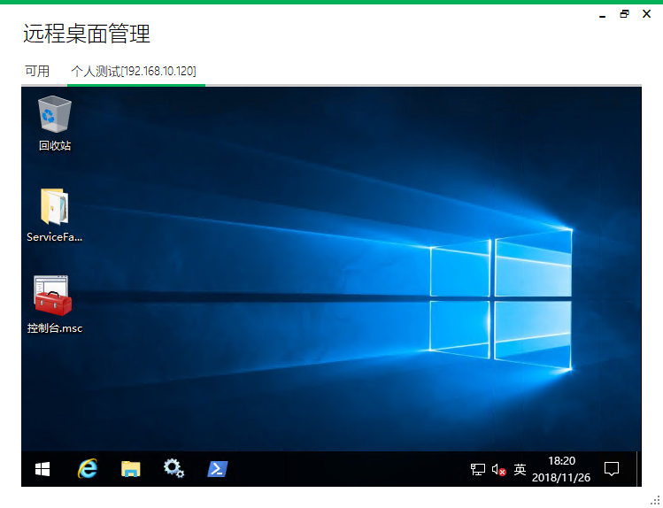

# 远程桌面管理工具 

基于 MSTSC 连接 Windows 远程桌面，并对其进行封装实现管理多个远程桌面配置的小工具

关键字：`AxMsRdpClient` `Dapper` `SQLite` `Winforms-Modernui`

效果图如下：

## 1、什么是 MSTSC (Microsoft terminal services client) ？
创建与终端服务器或其他远程计算机的连接，适用于 Windows XP 及以上的 Windows 操作系统

MSTSC 还有一种说法，Microsoft Telnet Screen Control ，即“微软远程桌面控制”。

**PS.** 相信对本项目感兴趣的朋友肯定熟悉下面微软的官方工具，本项目也是基于其 ActiveX 控件进行的封装，实现对远程桌面的管理与使用

## 2、赶紧来添加第一个远程桌面连接 ？
点击左下角的 `添加远程主机` 来，开启 `是否为父级` 选项，起个 `名字` 并 `保存` 来添加您的一个父级(分组)节点，譬如

再次点击点击左下角的 `添加远程主机` 来新建您的第一个连接，假定您已熟悉 MSTSC 相关设置，那么下面这个配置也难不住您了

单击此方块即可连接服务器，请确保网络无阻哦，一般来说 MSTSC 能连上，本工具同样可以

好了，基本上您已经掌握如何使用此工具了

## 3、还有其他功能应用？

* 支持拖动页签头来改变其位置 (同时连接了多个远程可能会有些用)

* 当你不想打开远程桌面，而只想打开远程服务器上的某个程序时，请在 `仅启动程序` 时填写需要启动程序的路径，如 `C:\Windows\System32\calc.exe` ，如果该目录已配置到环境变量的 `PATH` 中，如本示例使用程序名 `calc` 亦同

* 右击页面头会有菜单选项，比如可执行 `关闭` 操作，右击连接方块或分组名(父节点)可进行 `编辑`、`删除` 等操作
* 切换主题，偶尔换换口味吧
* 编辑时可以点击右上角的 `复制` 则保留该连接信息，点保存时换创建一个新的连接
* 鼠标中键关闭页签 (远程桌面)
* 键盘映射，当窗口处于活动状态远程桌面将获得键盘事件，当窗口不处于活动状态则本机获得键盘事件，建议点击远程窗口和本机任务栏来进行键盘映射的切换

以上功能均是出于我个人使用习惯，可能对您并不实用，所以文档也含糊一下啦，抱歉！

**PS. 假如您对本项目有兴趣，欢迎提 Pull Request 一起来完善它**

## 4、开始作死

[下载最新的 Releases 程序玩一把？](https://github.com/wang9563/RemoteDesktopManage/releases) `请安装 .NET Framework 4.6.1 及以上版本后使用`

**因为 .NET Framework 向下兼容，所以电脑上只需装最新的 net48 即可，需要对低版本 .NET Framework 支持？**

下载项目源码，修改 Framework 版本为 4.5 再编译，或者修改为 4.0 但需要单独引用 `Microsoft.Bcl` 编译后即可

本项目使用 [WTFPL 开源协议](LICENSE)，所以。。您怎么喜欢怎么来吧！
